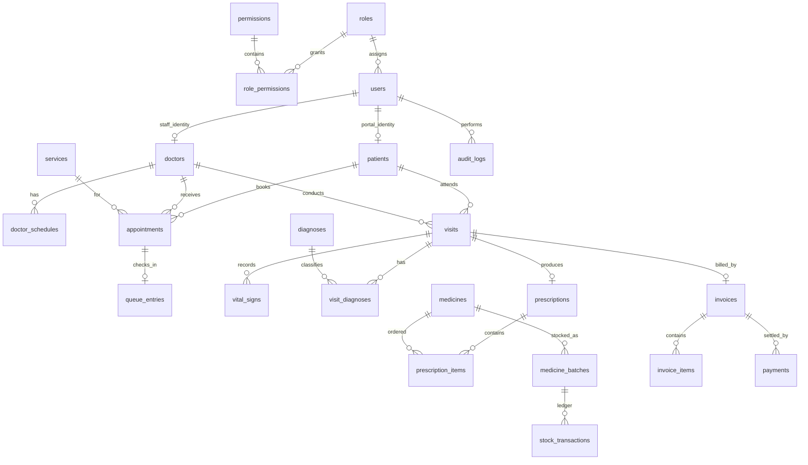

# Database ERD

```mermaid
erDiagram
  roles ||--o{ role_permissions : grants
  permissions ||--o{ role_permissions : contains
  roles ||--o{ users : assigns
  users ||--o| patients : portal_identity
  users ||--o| doctors : staff_identity
  doctors ||--o{ doctor_schedules : has
  patients ||--o{ appointments : books
  doctors ||--o{ appointments : receives
  services ||--o{ appointments : for
  appointments ||--o| queue_entries : checks_in
  patients ||--o{ visits : attends
  doctors ||--o{ visits : conducts
  visits ||--o{ vital_signs : records
  visits ||--o{ visit_diagnoses : has
  diagnoses ||--o{ visit_diagnoses : classifies
  visits ||--o| prescriptions : produces
  prescriptions ||--o{ prescription_items : contains
  medicines ||--o{ prescription_items : ordered
  medicines ||--o{ medicine_batches : stocked_as
  medicine_batches ||--o{ stock_transactions : ledger
  visits ||--o| invoices : billed_by
  invoices ||--o{ invoice_items : contains
  invoices ||--o{ payments : settled_by
  users ||--o{ audit_logs : performs
```

Phase 1 creates `roles`, `permissions`, `role_permissions`, `users`, and `refresh_tokens`. Later tables are introduced only by their owning phase.

